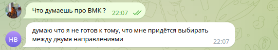

# sirius-test-nlp-2023
Кейс по NLP для смены по ML от Тинькофф в Университете "Сириус"

### Intro

В этом репозитории можно найти ноутбук для файн-тьюнинга [ruDialoGPT](https://huggingface.co/tinkoff-ai/ruDialoGPT-medium?text=%40%40%D0%9F%D0%95%D0%A0%D0%92%D0%AB%D0%99%40%40+%D0%BF%D1%80%D0%B8%D0%B2%D0%B5%D1%82+%40%40%D0%92%D0%A2%D0%9E%D0%A0%D0%9E%D0%99%40%40+%D0%BF%D1%80%D0%B8%D0%B2%D0%B5%D1%82+%40%40%D0%9F%D0%95%D0%A0%D0%92%D0%AB%D0%99%40%40+%D0%BA%D0%B0%D0%BA+%D0%B4%D0%B5%D0%BB%D0%B0%3F+%40%40%D0%92%D0%A2%D0%9E%D0%A0%D0%9E%D0%99%40%40) и скрипт с логикой чат-бота в Telegram, работающего на основе дообученной модели.

### Setup

- Для начала необходимо скачать данные из чата в Telegram в формате ```.json``` и добавить результирующий файл в папку ```data```. Я выбрала чат своего потока на ПМИ ФКН ВШЭ
- Далее необходимо дообучить предобученную модель. Для этого нужно запустить все ячейки в ноутбуке ```fine_tuning.ipynb```. Данные из Telegram будут обрабатываться внутри этого ноутбука с помощью скрипта ```prepare_messages.py```
- Попробовать пообщаться с дообученной моделью можно в секции Inference в ноутбуке ```fine_tuning.ipynb```
- В файле ```main.py``` прописана логика чат-бота на основе дообученной модели. Пока что бот запускается только локально, его юзернейм в Telegram: [@ecole_deconomie_ami_bot](https://t.me/ecole_deconomie_ami_bot)

### Examples



